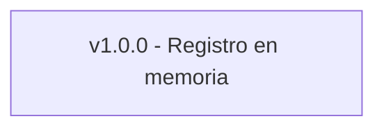

# SMVG - System Core


## ¿Qué es SMVG?

**SMVG** (Sistema de Modelado de Vida Gamificado) es un core experimental que transforma el uso del tiempo en evidencia cuantificable de identidad conductual.

Permite registrar ejecuciones (Execution), acumularlas y derivar métricas que reflejan consistencia y frecuencia conductual.

## Problema que resuelve

Actualmente no existe un modelo simple que permita representar identidad funcional basada en ejecución real y medible en el tiempo.
SMVG propone un núcleo mínimo para estructurar esa representación sin introducir juicio ni sistemas de recompensa artificiales.

## Modelo Conceptual

**Execution** → Evento mínimo conductual medible  
**Registro** → Persistencia temporal  
**Acumulación** → Agregación por unidad temporal  
**Métrica** → Indicador derivado  
**Identidad** → Patrón emergente de frecuencias

## Estado del Proyecto

🟢 v1.0.0 – Core funcional mínimo  
⚠️ Experimental – No recomendado para uso en producción

## Evolución del Sistema



### Características

- Registro de Execution
- Timestamp automático
- Acumulación en memoria
- Metrica de frecuencia diaria

## Arquitectura

```text
[Input] → [Registro] → [Acumulación] → [Métrica] → [Visualización]
```

## Métrica implementada

- Frecuencia acumulativa pr unidad temporal (día)

## Próxima Iteración

- Persistencia de datos
- Encapsulamiento del core
- Parametrización de unidad temporal

## Filosofía

SMVG no mide tareas. Mide consistencia.
Y la consistencia construye identidad.

## Instalación

1. Clonar el repositorio

```bash
git clone https://github.com/AbishaiFC/smvg-core.git
cd smvg-core
```

2. Correr el archivo system.js

```bash
node system.js
```
